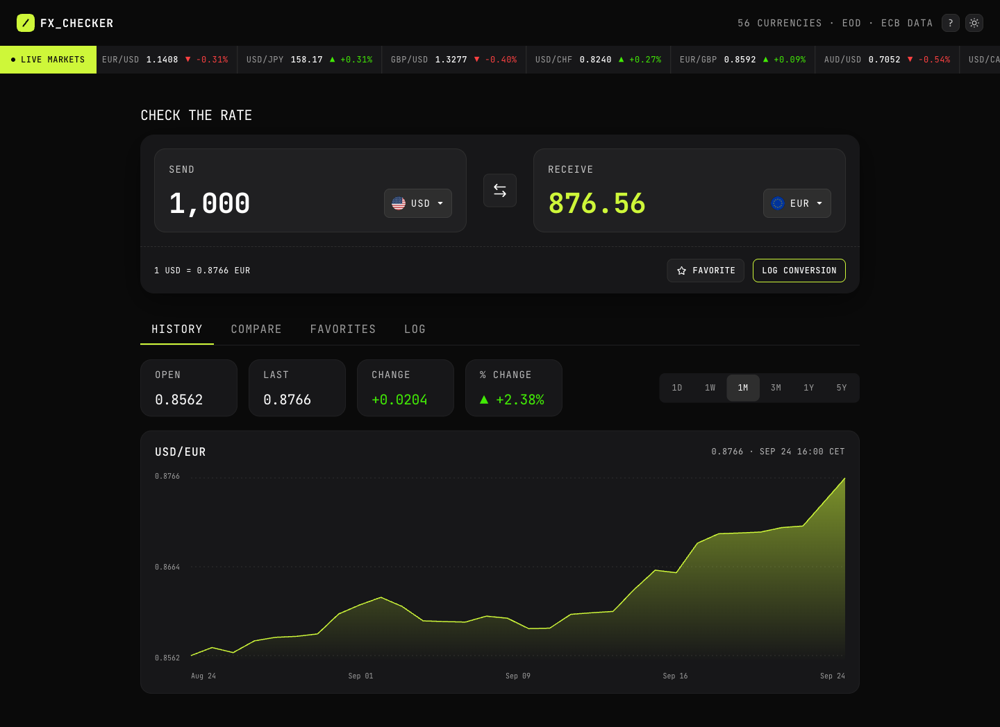
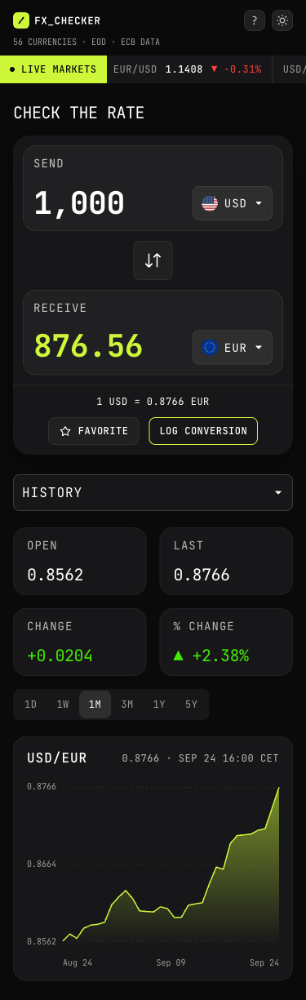

# Frontend Mentor - FX Checker solution

A currency converter built with live central-bank reference rates. It includes a searchable currency picker, a scrolling live-markets ticker, a rate-history chart, a multi-currency comparison, pinned favorite pairs and a conversion log. Everything you save stays in your browser.

This is my solution to the [FX Checker challenge on Frontend Mentor](https://www.frontendmentor.io/challenges/foreign-exchange-currency-converter).


## Table of contents

- [Overview](#overview)
  - [The challenge](#the-challenge)
  - [Screenshots](#screenshots)
  - [Links](#links)
- [Getting started](#getting-started)
- [Usage](#usage)
- [Project structure](#project-structure)
- [Tests](#tests)
- [My process](#my-process)
  - [Built with](#built-with)
  - [What I learned](#what-i-learned)
  - [Continued development](#continued-development)
  - [Useful resources](#useful-resources)
  - [AI Collaboration](#ai-collaboration)
- [Roadmap](#roadmap)
- [License](#license)
- [Author](#author)
- [Acknowledgments](#acknowledgments)

## Overview

### The challenge

Users should be able to:

- **Converter**:
  - Type an amount and see it convert as they type.
  - Pick the send and receive currencies from a searchable picker, and see the rate (`1 USD = 0.8530 EUR`).
  - Swap the two currencies.
  - Favorite the pair, or log the conversion.
- **Currency picker**: search by code or name, see currencies grouped into "Popular" and "Other currencies", with a check on the selected one.
- **Live markets ticker**: see scrolling currency pairs with their rate and 24-hour change.
- **Rate history**:
  - See a line and area chart for the active pair.
  - Switch the range: 1D, 1W, 1M, 3M, 1Y or 5Y.
  - See Open, Last, Change and % change for the range.
- **Compare**: see the send amount converted into eight currencies at once, and pin any row.
- **Favorites**: see pinned pairs with their live rate and daily change, load one into the converter, or unpin it.
- **Conversion log**: see relative time, pair and amounts for each conversion; delete one entry, or clear the whole log.
- **UI and accessibility**: responsive layouts, visible hover and focus states, and a fully keyboard-operable interface.

I also built the challenge's optional ideas:
- A light theme.
- The active pair saved in the URL, so it can be shared.
- Keyboard shortcuts.
- CSV export of the log.
- A hover crosshair on the chart.
- An offline fallback to cached rates, with an out-of-date banner.

### Screenshots

<p align="left">
  
</p>
<p align="left">
  
</p>

### Links

- Solution URL: _Frontend Mentor solution link coming after submission_
- Live Site URL: [fsdev-foreign-exchange-checker.vercel.app](https://fsdev-foreign-exchange-checker.vercel.app)
- Repository: [github.com/gusanchefullstack/fsdev-foreign-exchange-checker](https://github.com/gusanchefullstack/fsdev-foreign-exchange-checker)

## Getting started

**Prerequisites:** Node.js 20.19+ or 22.12+ (required by Vite 8; developed on Node 26) and npm.

```bash
git clone https://github.com/gusanchefullstack/fsdev-foreign-exchange-checker.git
cd fsdev-foreign-exchange-checker
npm install
npm run dev        # http://localhost:5173
```

You don't need an API key or environment variables. Rates come from the public [Frankfurter API](https://frankfurter.dev/).

## Usage

| Command | What it does |
|---------|--------------|
| `npm run dev` | Starts the Vite dev server with hot reload |
| `npm run build` | Type-checks (`tsc -b`) and builds to `dist/` |
| `npm run preview` | Serves the production build locally |
| `npm run lint` | ESLint with the TypeScript, React Hooks and jsx-a11y rules |
| `npm test` | Runs the Vitest suite once |

**Keyboard shortcuts** (they don't fire while you're typing in a field):

| Key | Action |
|-----|--------|
| `/` | Open the Send currency search |
| `s` | Swap currencies |
| `1`–`6` | Chart range 1D, 1W, 1M, 3M, 1Y, 5Y |
| `?` | Show or hide the shortcuts list |

**Share a pair:** the URL always reflects the active pair, for example [`?from=GBP&to=JPY`](https://fsdev-foreign-exchange-checker.vercel.app/?from=GBP&to=JPY).

## Project structure

```text
index.html               # Vite entry (loads /src/main.tsx)
public/assets/           # Flags, icons, logo and JetBrains Mono variable font
src/
├── App.tsx              # Top-level state: active pair, amount, tab, range; wires hooks to components
├── components/          # One folder per component: Component.tsx + .module.css + .test.tsx
├── data/                # Currency catalog (code → flag, design name), Popular/ticker/compare sets
├── hooks/               # useRates, useHistory, useFavorites, useConversionLog, useTheme, …
├── services/            # frankfurter.ts, the only module that calls fetch
├── styles/              # tokens.css (Figma variables + light theme), fonts.css, global.css
├── types/               # Domain types
└── utils/               # Rate math, formatting, relative time, CSV
specs/001-fx-checker-app/ # Spec, plan, research, data model, contracts, tasks, validation record
tests/                   # Vitest setup, fetch mocks and API fixtures
```

## Tests

The tests use [Vitest](https://vitest.dev/) with Testing Library, jsdom and [vitest-axe](https://github.com/chaance/vitest-axe) for automated accessibility checks.

```bash
npm test                                   # all 121 tests
npx vitest run src/utils/format.test.ts    # a single file
npx vitest run -t "swaps currencies"       # a single test by name
```

The tests cover:
- Rate math and number formatting.
- The API service's error mapping.
- Storage that's corrupt, missing or blocked.
- Every user story's acceptance scenarios.
- Keyboard behavior: tab order, arrow keys, and where focus lands after removing items.
- An axe run on every tab.

## My process

This project was built with **spec-driven development** using [GitHub Spec Kit](https://github.com/github/spec-kit). The steps were: constitution → specification → clarification → plan → tasks → consistency analysis → implementation. The artifacts are in [`specs/001-fx-checker-app/`](./specs/001-fx-checker-app/).

### Built with

- Semantic HTML5 and WAI-ARIA patterns (tabs, combobox with a listbox, radio group, live region)
- CSS Modules, CSS custom properties (design tokens), Flexbox, CSS Grid, and container queries
- Mobile-first, responsive from 320px up
- [React 19](https://react.dev/) + [TypeScript 6](https://www.typescriptlang.org/) (strict)
- [Vite 8](https://vite.dev/)
- [Frankfurter API](https://frankfurter.dev/) for exchange rates
- A hand-drawn SVG chart (no chart library)
- [Vitest](https://vitest.dev/), [Testing Library](https://testing-library.com/) and vitest-axe
- [Vercel](https://vercel.com/) for hosting

### What I learned

**1. Check the API before trusting the docs.** The challenge README lists `/v2/latest` and `/v2/{start}..{end}`, but both now return 404. The live v2 API uses `/v2/rates?base=&quotes=&from=&group=`. I also found the default feed blends several central banks (166 currencies), while the ECB-only feed has just 30. So the app shows the currencies that have a bundled flag.

**2. One request, then cross rates.** Instead of one request per pair, the app fetches USD-based rates for the last 10 days once. Every pair is then derived through USD, and the last two dates give the daily change:

```ts
// A → B = (USD → B) / (USD → A)
export function crossRate(usdRates: Record<string, number>, from: string, to: string) {
  const a = from === 'USD' ? 1 : usdRates[from]
  const b = to === 'USD' ? 1 : usdRates[to]
  return a && b ? b / a : null
}
```

**3. Accessible custom widgets.** For the currency picker, focus stays in the search field. The arrow keys move `aria-activedescendant` across a grouped `role="listbox"`, and Escape returns focus to the button that opened it. Lighthouse and axe checks caught subtler issues:
- A tab badge made the accessible name differ from the visible label.
- `<output>` is an implicit live region, so it announced every keystroke.
- Keyboard focus fell back to `<body>` after "Clear all" or deleting a row.

**4. A responsive SVG chart without a library.** The paths use a fixed `viewBox` with `preserveAspectRatio="none"` and `vector-effect: non-scaling-stroke`. The axis labels are HTML. So the chart stretches to any width, the lines stay crisp, and the text doesn't distort.

**5. Storage the app can survive without.** Every `localStorage` read is validated and falls back to defaults. That covers corrupt data, private mode and quota errors, and bad entries are dropped one at a time.

### Continued development

- Test with a real screen reader (VoiceOver/NVDA) as a routine step, not only automated audits.
- The single-key shortcuts should get an off/remap option to fully meet WCAG 2.1.4.
- Look into a service worker, so the offline fallback also covers loading the app itself.

### Useful resources

- [WAI-ARIA Authoring Practices: Combobox](https://www.w3.org/WAI/ARIA/apg/patterns/combobox/) and [Tabs](https://www.w3.org/WAI/ARIA/apg/patterns/tabs/): the keyboard models used for the picker and tabs.
- [Frankfurter API docs](https://frankfurter.dev/): the current v2 endpoints and the provider options.
- [MDN: CSS container queries](https://developer.mozilla.org/en-US/docs/Web/CSS/CSS_containment/Container_queries): how the big amounts scale down on small phones.
- [GitHub Spec Kit](https://github.com/github/spec-kit): the spec-driven workflow behind this project.

### AI Collaboration

I used **Claude Code** throughout, following the Spec Kit workflow:

- **Specification:** it turned my drafts into a constitution and a spec, asked clarifying questions (such as what "1D" means with end-of-day data), and caught contradictions before any code existed. Examples are the outdated API endpoints and the currency-count mismatch between the API and the design.
- **Design:** it read the Figma file through the Figma MCP server for design tokens, layouts and exact copy.
- **Implementation:** test-first, story by story, with lint, type-check and test runs after each one.
- **Verification:** it used Chrome DevTools for Lighthouse audits, checks at 320, 375, 768 and 1440px, and performance measurements.

What worked well was keeping the spec as the single source of truth, so every change traced back to a requirement. What still needs a human: a real screen-reader pass, and judgment calls where the design was inconsistent (for example, number formatting).

## Roadmap

- [x] Converter, picker, ticker, history, compare, favorites and conversion log
- [x] Light theme, shareable URL, keyboard shortcuts, CSV export, chart crosshair, offline fallback
- [ ] Option to turn off or remap single-key shortcuts (WCAG 2.1.4)
- [ ] Manual screen-reader audit

## License

The code is distributed under the MIT License. See [LICENSE](./LICENSE) for details. The challenge design and assets belong to [Frontend Mentor](https://www.frontendmentor.io).

## Author

**Gustavo Sanchez Galarza**

[](https://www.linkedin.com/in/gustavosanchezgalarza/)
[](https://github.com/gusanchefullstack)
[](https://hashnode.com/@gusanchedev)
[](https://x.com/gusanchedev)
[](https://bsky.app/profile/gusanchedev.bsky.social)
[](https://www.freecodecamp.org/gusanchedev)
[](https://www.frontendmentor.io/profile/gusanchefullstack)

## Acknowledgments

- [Frontend Mentor](https://www.frontendmentor.io) for the challenge, design and assets.
- [Frankfurter](https://frankfurter.dev/) for a free, key-less exchange-rate API.
- [JetBrains Mono](https://www.jetbrains.com/lp/mono/), the typeface used throughout.
